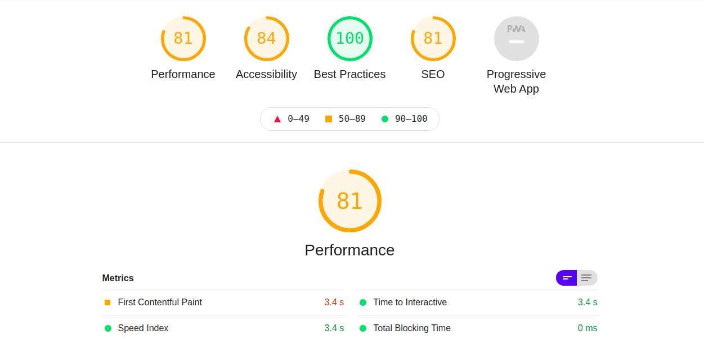
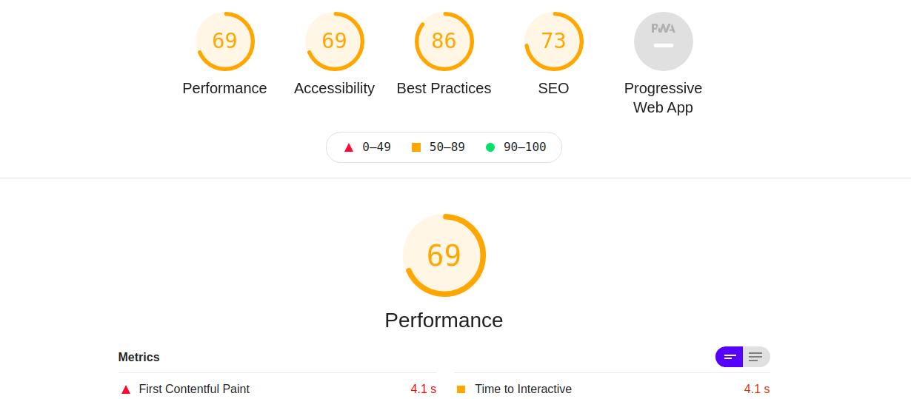
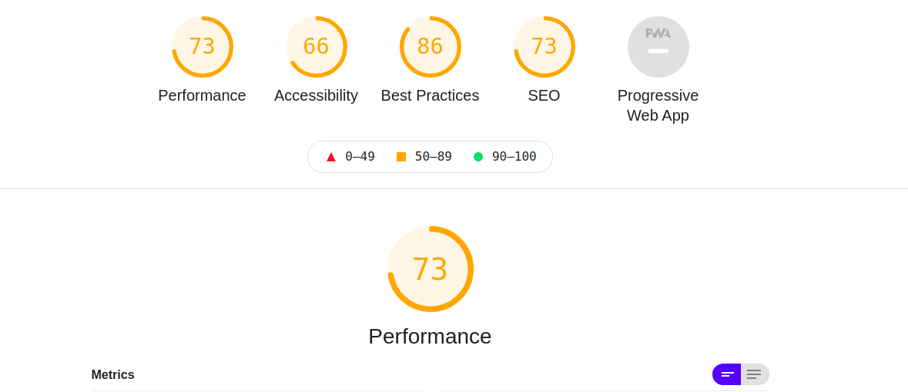
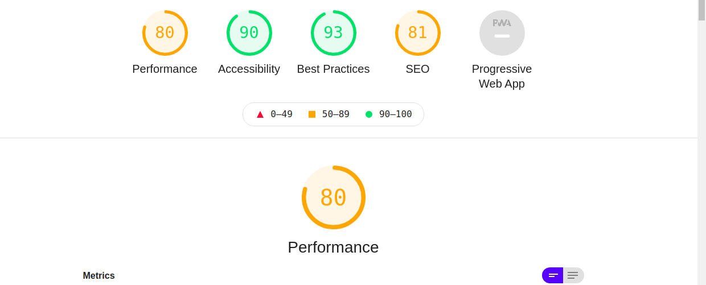
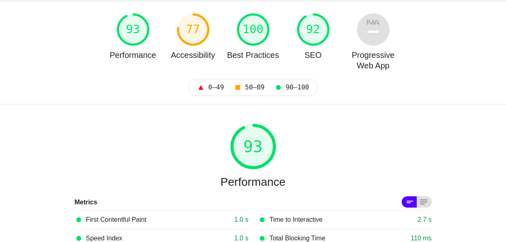

# Project-supro

## Instructions

[Project details](https://github.com/becodeorg/LIE-Jepsen-4.27/tree/master/01-the-field/04-html-css/03-client-project)

##  Who : Team Coco Chanel

 * Team members:

	* [Luciana Brancato](https://github.com/Luciana001) aka Lucia Grid
	* [Natascha Gritte](https://github.com/Dhaibuna) aka Gitstappo
	* [Richard Denys](https://www.linkedin.com/in/richard-denys-b78960185) aka Richard Git 
	* [Tomi Szobonya](https://github.com/szobonyatomi) aka Tomi Fix

## What is Supro and why ? 

**Supro** is a online shop website layout. Our team's mission was to integrate a design using HTML & CSS. 
The project can be considered as the **Becode** **_"Field" step's_** final project of our promo **Jepsen 4.27 (2021)**.

## What it looks like ? 

[Click to open our version](https://szobonyatomi.github.io/project-supro/)

- What ? I saw you, you didn't click :) So take a look at our performances : 

*About*        
      
*Homepage*          
      
*Shop*       
       
*Product*          
      
*Contact*           
     

And now, did I hooked you ? 

### **[Click to open our version](https://szobonyatomi.github.io/project-supro/)**

## What did we used exactly ? 

- **HTML** ( *Captain Obvious is on holiday, I'm his substitute* )

- **Bootstrap** which is a CSS Framework, really useful and practical one, adapted to the project's needs. 

## Status ? 

Welln theorically it's finished. But as you can see, our performances can be improved so ... why not return on it for fun later ? If so and that you did'nt forgot about our existence, you will eventually see it in a further section named "Gitlog" ;) 

 